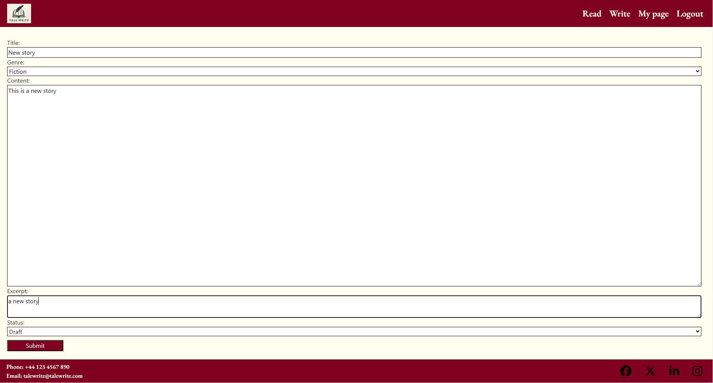
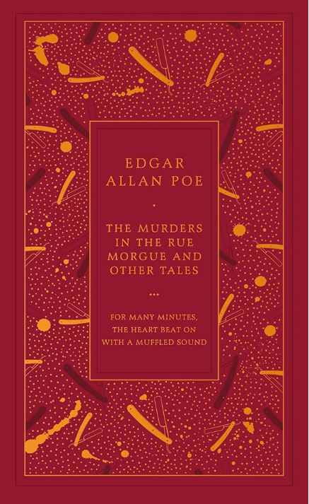

<h1>TaleWrite README.MD</h1>

<h2>Introduction</h2>

TaleWrite is a short story website. It provides the user the ability to write and publish their short tales on the website, edit them if desired, and read the published tales of other authors. By creating their own account they can then interact with site including liking the tales of other users, and provide a genre and short excerpt to intrigue potential readers on the main page which is a listing of other published tales. Lastly the "published on" attribute allows authors and readers to keep track of tales and return to edit, delete, or read again if desired.

Please be aware that TaleWrite is the name of the project, which changed from ProjectJournal in the code. And in following ReadME, "entry" is synonymous with "tale".

## Read page (home and landing page for first time users)

The landing page of the website allows users to see the TaleWrite logo for brand visibility, and list of published tales, including a short excerpt, genre, author, and the time and date the tale was published on. It informs the user if they are logged in or not with a welcome back message if logged in, and a login or sign up message if not. If the user atempts to read a tale without logging in they will be redirected to the login page.

<strong>Landing/read page</strong>

## Read page (home and landing page for returning users) 

<strong>Read</strong>

Mobile size resolution of write pageUnfortunately we're unable to show you mutiple devices due to amiresponsive not able to show you authentication required webpages

 

<strong>Write</strong>
 

 

<strong>Read: Tale</strong>

 

<strong>Read: Tale from non-author's POV</strong>

This page shows the bottom of a Read:Tale page showing a like button and comments section. It is possible for readers to leave a comment which awaits moderation before being published.

<strong>Read:Tale from author's POV</strong>

This page shows the bottom of a Read: Tale page showing the options available to the author of the tale. This includes a delete button, edit button, and like button. These are only visible to the user who is also the author of the tale. It is also possible to leave a comment, usually it would be in response to another users comment.

<strong>Delete</strong>

This shows the delete function having been used which then displays a "entry deleted successfully" message, and redirect to the homepage.

 

This shows the edit function having been used which then displays a "entry deleted successfully" message, and redirect to the homepage.

 

## Design Choices

TaleWrite adopted a distinctive, rich and warm-dark colour scheme. We want the user to feel as thought they are relaxing in an old leather chair with a brandy, and smell the musky pages as they read and write. It was inspired by an Edgar Allen Poe book of short stories.

We selected the Garamond font style, and increasing or decreasing the font-weight as appropriate. 'https://fonts.google.com/specimen/EB+Garamond'. It works together with our colour scheme to create the impression of reading a book printed many decades ago.

## Wire Frames

Initially I wanted to provide images that would excite and inspire the user of the site but it simply didn't work elegantly or provide the font with clarity therefore the hero images and parchment background were dropped in favour of a monotone off-white for readibility.

<strong> </strong>

## Quiz page

We ensured that we provided wireframes to cover all the different stages of user experience and features. We also test our colour schemes to ensure readibility using a contrast checker

## User Stories, features and bugs

I used a canban board and the MSCW approach to my user stories and features. Unfortunately some I decreed to fall outside the scope of this project given time and staffing limitations. 

There were others that I intended to do, however despite all efforts and the importance of the features, remain uncompleted this sprint.

<table>
  <tr>
    <th>User Story</th>
    <th>Features</th>
    <th>Bugs / Issues - tested across viewports of all devices using Google Dev Tools</th>
  </tr>
   <tr>
    <td>As a site user, I want a flowing user experience. </td>
    <td>Ability to navigate from feature to feature without feeling surprised</td>
    <td>The success messages on submitting an entry, edit or comment I wanted to get inside the Navbar but was unable to do so. Also for some reason the user after logging in is taken to the write function</td>
   
    
  </tr>
  <tr>
    <td>As a site user I can sign up register an account so I can log in and interact with the site</td>
    <td>Register and sign up functions</td>
    <td>None detected</td>
  
  </tr>
   <tr>
    <td>As a site owner, I want the logo clearly visible to increase brand recognition.</td>
    <td>Logo clearly visible on landing/options page.</td>
    <td>None detected</td>
  <tr>
    <td>As a user, I want to be able to leave comments and have other users comment on my entries</td>
    <td>Comments section in which users can leave comments below entries, pending moderation from the superuser</td>
    <td>None detected</td>
  </tr>
  <tr>
    <td>As site owner I want to be able to moderate comments to ensure a pleasent toxicity-free community of authors and readers</td>
    <td>Superuser needs to authorise all comments before they are published</td>
    <td>None deteced</td>
    
  </tr>
  <tr>
    <td>As a site user I want to be able to easily access all published stories</td>
    <td>Stories easy to upload and clearly visible on website.</td>
    <td>Although uploading is easy and entries are clearly visible, the ability to filter/sort wasn't completed (see user story below). </td>
    
  </tr>
  <tr>
    <td>As a site user I want to be able to filter/sort all published stories so I can access specific ones</td>
    <td>Different features of site are clearly identifiable</td>
    <td>None detected</td>
    
  </tr>
  <tr>
    <td>As a user, I want to be able to choose an answer from a pre-populated list.</td>
    <td>List of answers to be selected</td>
    <td>None detected</td>
    
  </tr>
  <tr>
    <td>As a user, I want to receive feedback on the answers.</td>
    <td>Clear signal of correct / incorrect answer</td>
    <td>None detected</td>
    
  </tr>
  <tr>
    <td>As a user, I want the site to be visually appealing.</td>
    <td> Select complementary colour scheme.  
    Different elements/features delineated.</td>
    <td>None detected</td>
    
  </tr>
  <tr>
    <td>As a user, I want to be able to start the quiz.</td>
    <td>Page loads and includes necessary event listeners</td>
    <td>None detected</td>
    
  </tr>
   <tr>
    <td>As a site owner, I want to use an API so that I can source questions from an outside repository.</td>
    <td>Questions load clearly in each different category and difficulty</td>
    <td>Sometimes quiz repeats questions, or includes them from higher difficulties.</td>
    
  </tr>
      <td>As a user, I want to sort the questions by categories so I can test myself on specific topics.</td>
    <td>Drop-down menu specifying topic category</td>
    <td>None detected</td>
    <tr>
      <td>As a user I want to challenge myself against different degrees of difficulty depending on my level of knowledge</td>
    <td>Drop-down menu specifying difficulty level</td>
    <td>Sometimes quiz repeats questions, or includes them from higher difficulties.</td>
    </tr>
    <tr>
    <td>As a user, I want to be greeted by name when I enter the website for personalisation and to feel welcome.</td>
    <td>Input Name field and have name saved when user returns (cookies required)</td>
    <td>None detected</td>
  </tr>
     <tr>
    <td>As a user I want to see my score</td>
    <td>Current score display to keep score updating</td>
    <td>None detected</td>
  </tr>
    <tr>
    <td>As a user I want to be able to share the fun I am having doing the quiz, and challenge my friends.</td>
    <td>"Share with friends" copy link button. Post to FB / Instagram / X clickable icons.</td>
    <td>Ran out of time to add Instagram and X icons</td>
  </tr>
    <tr>
     <td>As a site owner I want to increase the visibility and thus usership of our website.</td>
    <td>"Share with friends" copy link button. Post to FB / Instagram / X clickable icons.</td>
    <td>Ran out of time to add Instagram and X icons</td>
  </tr>
    <tr>
     <td>As a user, I want to be able to adjust the number of questions I am asked to try shorter or longer games.</td>
    <td>Dropdown menu providing game length options</td>
    <td>Sometimes quiz repeats questions, or includes them from higher difficulties.</td>
  </tr>
  </table>

 

### User Stories and Features (to be implelemented next Sprint) 

  <table>
  <tr>
    <th>User Story</th>
    <th>Features</th>
    <th>Bugs / Issues</th>
  </tr>

  <tr>
    <td>As a user I want to be able to store my highest score to see if I can beat it on my future visits.</td>
    <td>Highest score from previous use visible (cookies required)</td>
    <td>N/A</td>
  </tr>
  

  </table>

### Won't haves

  <table>
  <tr>
    <th>User Story</th>
    <th>Features</th>
    <th>Bugs / Issues</th>
  </tr>
  <tr>
    <td>As a user, I want to have a countdown timer to challenge myself to answer more quickly.</td>
    <td>A countdown timer to display either how long I have left to answer the question before it assigns to wrong</td>
    <td>N/A</td>
  </tr>
    
 
  <td>As a site-owner I want to have a questions backup in case the API  stops working.</td>
    <td>A secondary API or source of questions in case the first API breaks down</td>
    <td>N/A</td>
  </table>

## Fixed Bugs / Issues
 
<table>
  <tr>
    <th>Bug/Issue</th>
    <th>Image</th>
    <th>Resolution</th>
  </tr>
  <td>"Select type" option overflows to below options box on smaller devices</td>
    <td></td>
    
  <td>We added media queries to ensure effective responsiveness</td>
  </tr>
      
  </tr>
    <td>Quiz-E would display without questions and just show questions marks when user left all questions to default(i.e.Any).</td>
   <td></td>
   <td>We required the user to enter Questions Length, and API call modified to accommodate this by leaving the “any” option off the API call.</td>
  </tr>
      
  </tr>
    <td>Sometimes after answering several questions the questions would stop changing</td>
   <td></td>
    
  <td>The problem lay was that when too many requests were made from the API in too small a space of time. Therefore to fix this we implemented a required delay of three seconds between committing answers</td>
  </tr>
  </table>

## Unfixed Bugs / Issues
 
<table>
  <tr>
    <th>Bug/Issue</th>
    <th>Image</th>
    <th>Resolution</th>
  </tr>
  <td>On large devices the "Enter name" box obscures the brand logo and feels like a pop-up rather than an integrated element of the UX package</td>
    <td></td>
    
  <td>Unfortunately we ran out of time to fix this. We would in future sprints change from an in-browser alert box to a html modal box, that would be styled and centred on the screen etc as part of a user management system.</td>
  </tr>
      
  </tr>
    <td>Sometimes quiz repeats questions, or includes them from higher difficulties. As an example of both, this question came up twice in a quiz set to easy.</td>
    <td></td>
    
  <td>Unfortunately none available as source of questions is the API. The only fix would have been to change the API from a paid provider but this would be costly and we would have had to change too much code by the time we realised</td>
  </tr>
    
  </tr>
  <td>Three second delay between answer and next question</td>
    <td></td>
    <td>The delay was a fix to a bug of the site crashing when too many requests were made from the API in too small a space of time(see "Fixed Bugs" above). The only fix would have been to change the API from a paid provider but this would be costly and we would have had to change too much code by the time we realised</td>
      <tr>
      <td>Only a share to FB button, no instagram or X buttons</td>
       
    <td></td>
    <td> <br Ran out of time to add this sprint, but definitely would be added Instagram and X buttons on a future sprint  </td>
  </tr>
  <tr>
      <td>Spelling errors on website </td>
    <td></td>
    <td>Unfortunately none available as source of questions is the API. The only fix would have been to change the API from a paid provider.</td>
    
    
  <table>
  
  </tr>

  </table>

### Validator Testing 

For HTML validation https://validator.w3.org/

For CSS validation  https://jigsaw.w3.org/css-validator/

  

## Deployment

Site successfully deployed on https://kjwhitehead.github.io/quizzee_rascals/

## Credits 

Color Scheme: “Bright Accent Colors” https://visme.co/blog/website-color-schemes/

### Content 

Timer used to display delay issue https://www.online-stopwatch.com/

Responsiveness displayed on https://ui.dev/amiresponsive

API Questions taken from https://opentdb.com/

Code initially inspired by and re-written https://opentdb.com/

Logo from Canva https://www.canva.com/

For validation in HTML https://validator.w3.org/

For validation in CSS https://jigsaw.w3.org/css-validator/

For ReadME table https://www.shecodes.io/athena/2362-creating-a-table-with-4-columns-and-4-rows-in-html

Wireframes produced using Balsamiq WireFrames https://balsamiq.com/wireframes/?gad_source=1&gclid=CjwKCAiA44OtBhAOEiwAj4gpOexFh0z3peWS6wolbjlJt_fLq7cZGNu99YeMSIpU89wlL2p6ZluXiRoCOSUQAvD_BwE

Timer used to display delay issue https://www.online-stopwatch.com/

## Other General Project Advice

Enjoy the Quiz!