<h1>TaleWrite README.MD</h1>

<h2>Introduction</h2>

TaleWrite is a short story website. It provides the user with the ability to write and publish their short tales on the website, edit and delete, and read the published tales of other authors. 

By creating their own account they can interact with the site.

Features include including a search bar, likes, genres, and excerpts to intrigue potential readers on the home page - which doubles as a listing of published tales. 

There is also the option to visit "my page" which allows users to see and edit their own drafts and published tales.

Please be aware that in following ReadME, "entry" is synonymous with "tale".

## Landing page

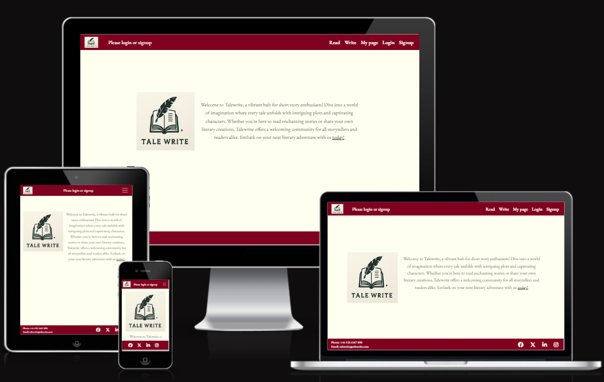

 

A short introduction to the site explaining its concept and displaying the brand logo.

 

## Sign up

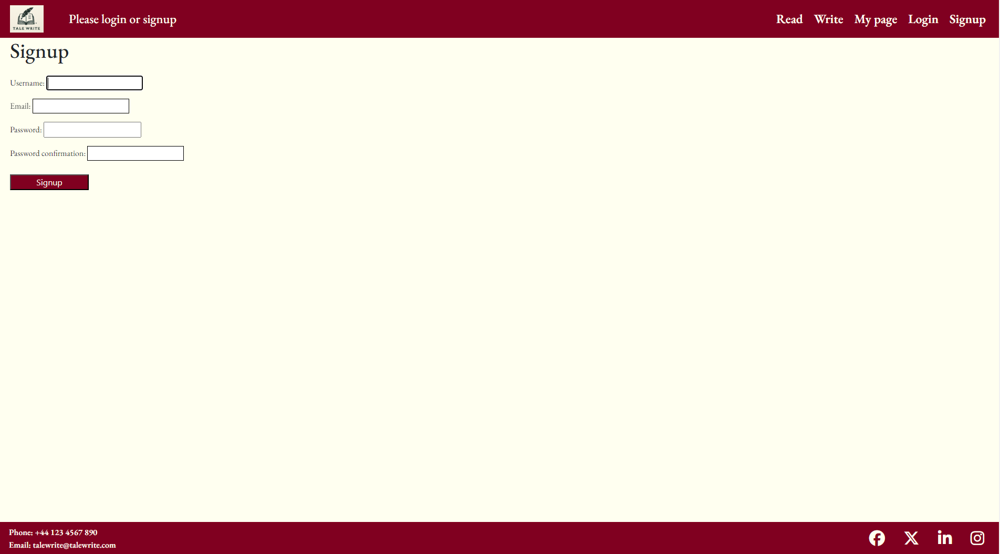

 

Sign up page showing username, password, password confirmation, and email input fields

 

## Log in

 

Login page showing username and password input fields

 

## Entries list / Read page (logged out)

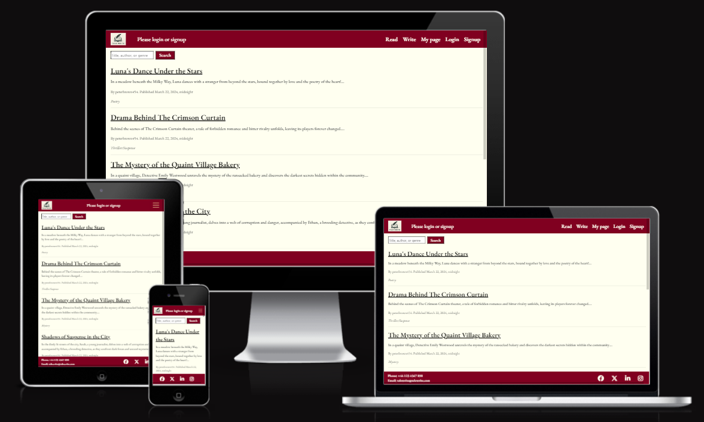

The entries_list / "read" page displays a list of published tales, and a short excerpt, genre, author, and the time and date the tale was published on. 

The search bar allows users to search for specific tales, author, or entries of a particular genre.

If the user attempts to read a tale without logging in they will be redirected to the login page.

The header and footer are consistant across all pages and include social media links, except for the addition of company email and phone number on medium and larger devices.

 

## Entries list / Read page (logged in) 

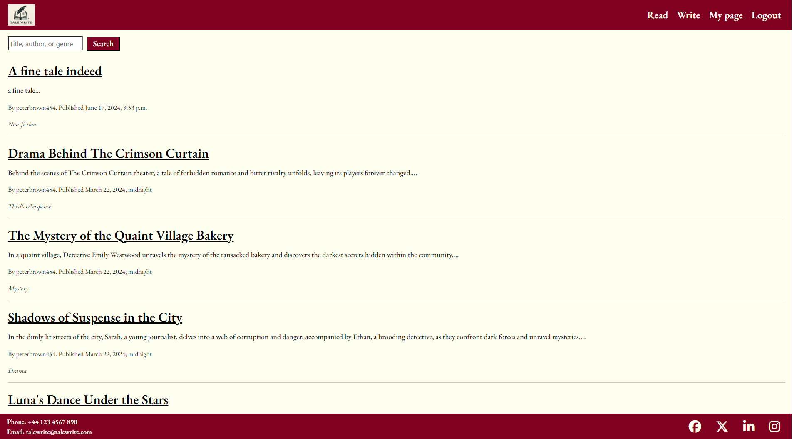

 
List of published tales with message but without the message requesting they log in or sign up and with Logout as an option.

 

## My page

 

My page presents users with all their own entries, which includes entries with the status of "draft". This allows users to continue working on their tales without public scrutiny, until they are ready to publish them to the entries list home page. They can also search their own entries for specific titles or by genre.

 

## Write
 

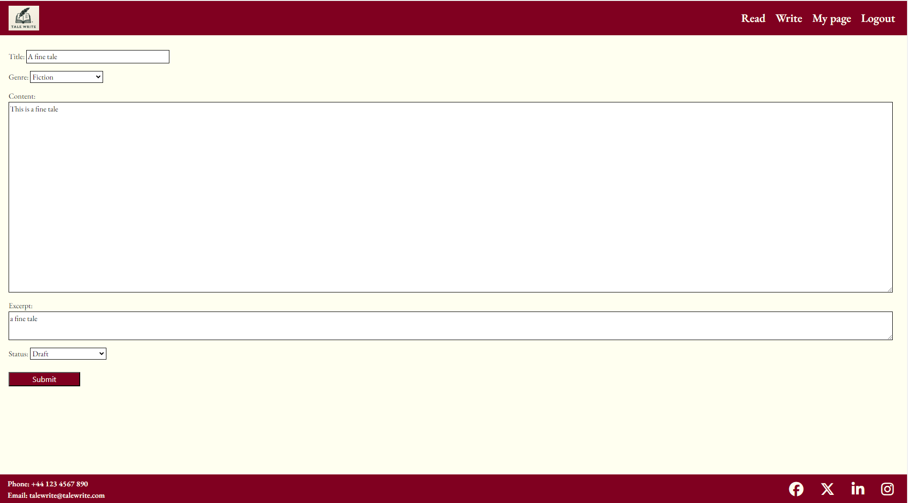

 

Write page showing form with title, content, excerpt, and genre fields, with submit button

 

## Published tale, Author's POV. Delete, edit, and comments displayed.

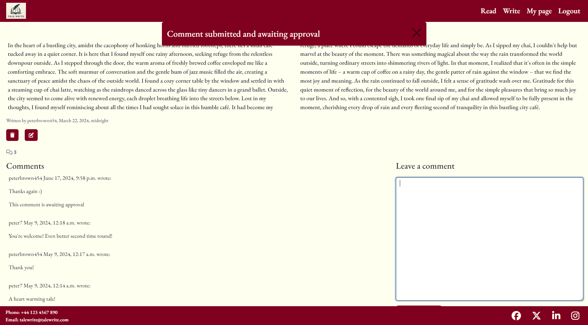

 

Tale content with comments section, edit, and delete button. Banner messages showing recently submitted comment is awaiting approval. 

 

## Read tale: Reader's POV

 
This page shows a published tale from a reader's (who is not the author) point of view. It allows the author access to a "like button" but not edit and delete. You also can't see the comment that has yet to be approved.

 

## Edit tale

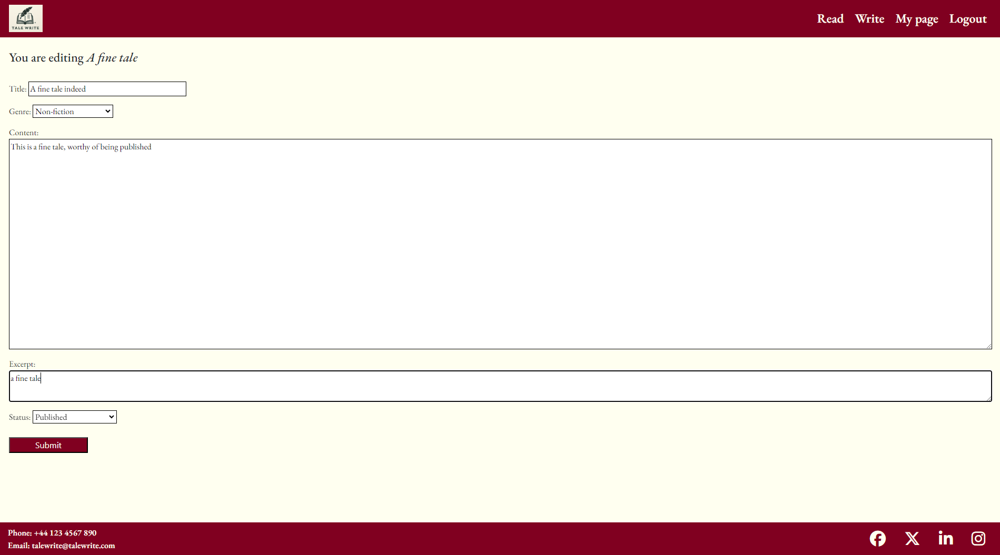

 

## Tale successfully edited

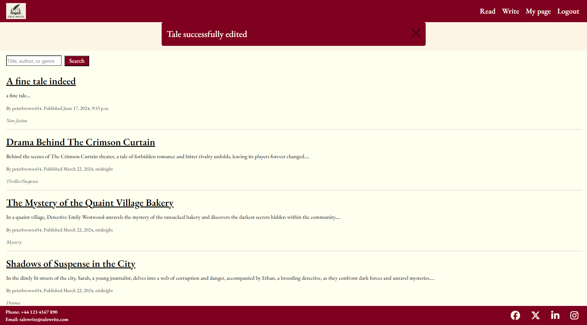

This shows the delete function having been used which then displays an "entry edited successfully" message, and that you have been redirected to the homepage.

## Delete "are you sure?"

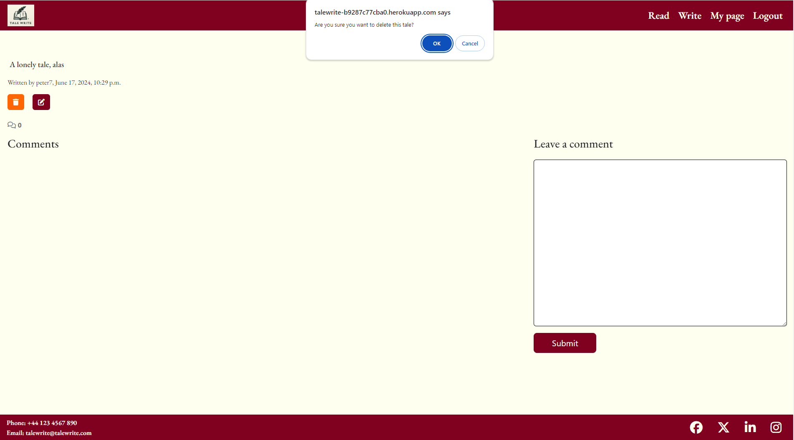

 

This shows the delete button having been clicked confirming with the user "are you sure you want to delete this tale?"

 

## Delete confirmed

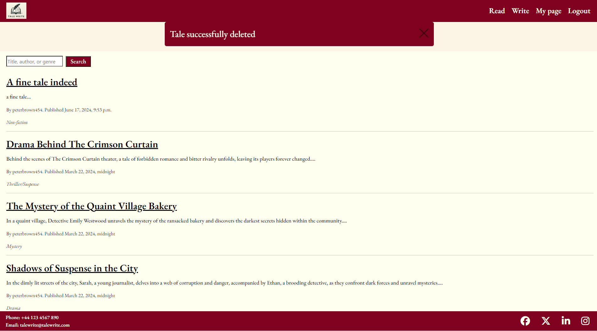

 

This shows the delete function having been used which then displays an "entry deleted successfully" message, and that you have been redirected to the homepage.

 

## Design Choices

TaleWrite adopted a distinctive, rich and warm-dark colour scheme. We want the user to feel as thought they are relaxing in an old leather chair with a brandy, and smell the musky pages as they read and write. It was inspired by an Edgar Allen Poe book of short stories.

   

For fonts I selected the Garamond style, and increasing or decreasing the font-weight as appropriate. 'https://fonts.google.com/specimen/EB+Garamond'. It works together with our colour scheme to create the impression of reading a book printed many decades ago.

 

# Wire Frames

Initially I wanted to provide images that would excite and inspire the user of the site but it simply didn't work elegantly or provide the font with clarity therefore the hero images and parchment background were dropped in favour of a monotone off-white for readibility.

 

## Home page

I thought that a landing page that implies the story of the website would be a nice user experience, but the hero image rendered the text of the entries list illegible.

 

## Account sign-up page

Login Page ended up was pre packaged by Django so we ended up with a fairly similar page but without the email address field.

## Read page

I think that we did better in the end with some extra features than initially envisaged. 

 

## Write page

Write entries page. I feel that in actuality this was probably better than anticipated. I was able to add other fields such as excerpt and genre which I think add texture to the user experience.

 

## Database Schema

  

Before performing any model migrations to my database, I devised an entity relationship diagram to visualise the connections between the models. There was a lot of edits to the models made throughout the process which shows why it's good to have a clear idea in advance.

 

## User Stories, features and bugs

I used a canban board and the MSCW approach to my user stories and features. 

Some I decided fell outside the scope of this project given time and staffing limitations. 

There were others that I intended to do, however despite all efforts and the importance of the features, remain uncompleted this sprint.

  

<table>
  <tr>
    <th>User Story</th>
    <th>Features</th>
    <th>Bugs / Issues - tested across viewports of all devices using Google Dev Tools</th>
  </tr>
   <tr>
    <td>As a site user, I want a flowing user experience. </td>
    <td>Ability to navigate from feature to feature as expected without interruption or detour</td>
    <td>-Success messages after all successful user interaction with the site may damage the user experience after a while for the user.
     However there is a x function to remove the message immediately. Unfortunately as well it wasn't possible to get the message to overlay the navbar which is a bug to be fixed next sprint.

</td>
   
    
  </tr>
  <tr>
    <td>As a site user I can signup an account so I can login and interact with the site</td>
    <td>Sign up functions</td>
    <td>None detected</td>
  
  </tr>
   <tr>
    <td>As a site owner, I want the logo clearly visible to increase brand recognition.</td>
    <td>Logo clearly visible on landing/options page.</td>
    <td>None detected</td>
  <tr>
    <td>As a user, I want to be able to leave comments and have other users comment on my entries</td>
    <td>Comments section in which users can leave comments below entries, pending moderation from the superuser</td>
    <td>The necessity for all comments to be moderated may hurt the user experience and decrease sense of immediacy and intimacy in the community</td>
  </tr>
  <tr>
    <td>As site owner I want to be able to moderate comments to ensure a pleasent toxicity-free community of authors and readers</td>
    <td>All comments await moderation from superuser, and an automatic message informs commenter of this</td>
    <td>None detected</td>
    
  </tr>
  <tr>
    <td>As a site user I want to be able to easily access all published stories</td>
    <td>Stories easy to search for based on genre author or title</td>
    <td>None detected</td>
    
  </tr>
  <tr>
    <td>As a site user, I want to be able to edit my own entries</td>
    <td>A button that allows the user to edit their own entries is generated on the "entry_detail" page (read specific entry) if the author and user are the same.</td>
    <td>None detected</td>
    
  </tr>
  <tr>
    <td>As a site user, I want to be able to delete entries.</td>
    <td>A button that allows the user to edit their own entries is generated on the "entry_detail" page (Read) page if the author and user are the same. There is also a javascript alert that pops up requesting confirmation "Are you sure you want to delete this tale?"</td>
    <td>Unfortunately I was unable to code a "request confirmation" function that would be seamless within the styling of the site, which will likely disrupt the user experience and may make them uncomfortable about clicking what looks like a popup from an external  site.</td>
    
  </tr>
  <tr>
    <td>As a user, I want the site to be visually appealing.</td>
    <td>Rich tawny burgundy invokes the vibe of old leather and relaxation, and off-white yellow suggests old, well-read book pages. The logo of an open book and quill adds to the old fashioned hues</td>
    <td>None detected</td>
    
  </tr>
  <tr>
    <td>As a user to be able to leave a short excerpt to entice others to read my entries</td>
    <td>Excerpts are required field for all entry submissions. An elipsis will automatically append to the end of the excerpt to increase the intrigue.</td>
    <td>None detected</td>
    
  </tr>
    <tr>
    <td>As a user I would like my data and entries to be secure from interference from other users</td>
    <td>Passwords are required to login and users cant access individuals stories without logging in. Also only authors can see the edit and delete buttons on their own entries. Also  there is further authentication required, to prevent even users who guess the url of the page from accessing the edit or delete URLS unless they are the author of the entry.</td>
    <td>None detected</td>
    
  </tr>

  <tr>
    <td>As a user I would to be able to see and easily access all my tales in one place</td>
    <td>"My page" allows users to access all their entries quickly and easily</td>
    <td>None detected</td>
    
  </tr>
  
   
  </table>

 

## User Stories and Features (to be implelemented next Sprint)

  <table>
  <tr>
    <th>User Story</th>
    <th>Features</th>
    <th>Bugs / Issues</th>
  </tr>

  <tr>
    <td>*Epic* As a user, I want to a profile page in which I can have all my entries available to be seen in one place and users can follow me / me follow other users</td>
    <td>Profile page needed and "follow author" feature</td>
    <td>Unfortuntaly ran out of time this sprint</td>
      <tr>
    <td>As a site user I want to be able to reset my password easily</td>
    <td>The email entry function is there so there needs to be an email sent with a link that allows the user to reset their password</td>
    <td>Unfortunately ran out of time this sprint</td>

  </tr>

  </tr>

    
  </tr>>
  

  </table>

## Won't haves

  <table>
  <tr>
    <th>User Story</th>
    <th>Features</th>
    <th>Bugs / Issues</th>
  </tr>
  <tr>
    <td>As a user, I want to be able to collaborate on stories with other users</td>
    <td>The ability to co-write entries may be very fun but seems fraught with hazards. It sounds like a merge error waiting to happen.</td>
    <td>N/A</td>
  </tr>
    
 
  <td>Monthly random genre/ picture prompt competition</td>
    <td>API to provide a random picture to act as a prompt once a month and the user with the highest number of likes within the month wins a digital trophy. Failing that a randomly selected genre from a list. However whilst this may be able to be coded in the sies 2.0 or 3.0, it isnt a core functionality and therefore isn't to be prioritised.</td>
    <td>N/A</td>
  </table>

## Fixed Bugs / Issues
 
<table>
  <tr>
    <th>Bug/Issue</th>
    <th>Resolution</th>
    <th>Image</th>
  </tr>
  <td>CSS not working at all. I could see in dev tools that it wasn't being even sent let alone rendered on the page.</td>
    
    
  <td>It turned out that it was an issue where the style.css in both static and static files needed to both be up to date</td>
  </tr>
      
  </tr>
    <td>The submit button would disappear beneath the footer no matter the media query</td>
   
   <td>CSS position: sticky solved the problem and kept the footer and header at the top of the page without obscuring other items</td>
  </tr>
    </tr>
    <td>Due to having gone off the LMS tutorial to use NetNinja I had produced my edit function using a class rather than method which meant I couldn't pick the LMS method of authenticating</td>
  <td>The answer was on stack overflow that there are built in django methods available and actually its quite simple</td>
    <td></td>
  </tr>

  

  </table>

## Unfixed Bugs / Issues
 
<table>
  <tr>
    <th>Bug/Issue</th>
    <th>Image</th>
    

      
  </tr>
    <td>When user presses refresh having submitted a comment on an entry then it resubmits the entry</td>
    <td></td>
    
  <td></td>
  </tr>
    
  </tr>
  <td>Part bug / part fix. Custom html pop up to confirm user wishes to delete their entry. Style is out of keeping with the rest of the site and maybe even a security concern for a user.</td>
    <td></td>
    <td></td>

  <tr>
    <td>The same user can like an entry an indefinite number of times.</td>
    <td>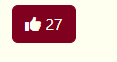</td>
     </td>
    <tr>
    <td>No apparent impact on functionality, however a single error in source code of website when a user views another author's tale. Unfortunately unable to be fixed this sprint due to time constraints.</td>
    <td>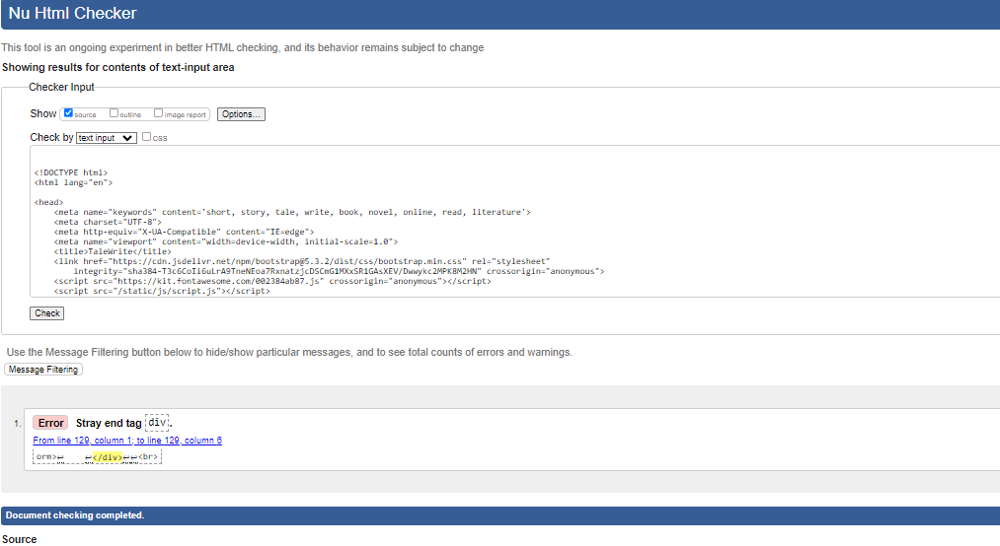</td>
    
  <td></td>
  </tr>

  </table>

## Validator Testing 

### HTML validation 
 
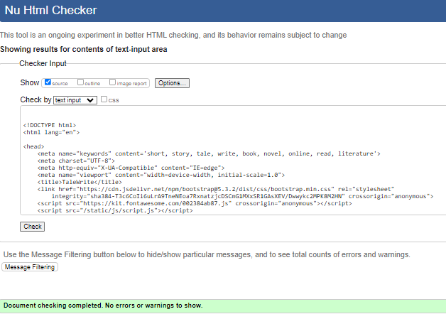

 

All pages HTML validated with https://validator.w3.org/. As per bug testing report above, a single error is present when a user views another author's tale. However otherwise all pages are validated and error free.

 

### CSS validation
 

  
   
  
All CSS validated and error free using  https://jigsaw.w3.org/css-validator/

 

### Javascript validation

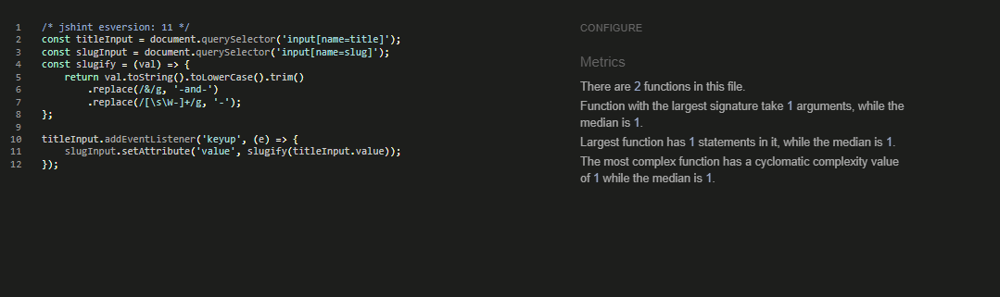  

All Javascript successfully tested and validated using JS Hint https://jshint.com/

### Python validation

All Python successfully tested and validated using Pep8c1 from Code Institute https://pep8ci.herokuapp.com/

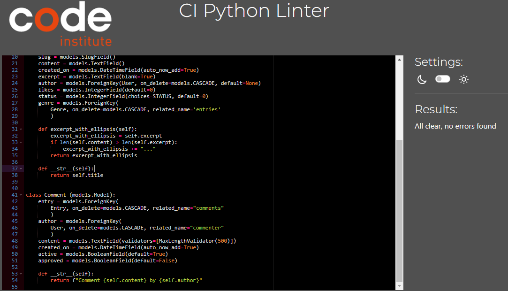 

## Contrast checking 

 

 

 

## Lighthouse from google dev tools performance and accessibility 

 

 

   

## Deployment

Site successfully deployed on https://talewrite-b9287c77cba0.herokuapp.com/

## Credits 

"Netninja" django blog tutorials https://www.youtube.com/watch?v=n-FTlQ7Djqc

Django Crispy Forms (https://django-crispy-forms.readthedocs.io/en/latest/install.html) 

"Code Institute", for initital django and elephant sql and heroku installation

Code Institute Student services for various questions regarding how to install/operate django

Stack overflow for various questions regarding how to install/operate django

How to remove help-text that was invalidating my code https://stackoverflow.com/questions/13202845/removing-help-text-from-django-usercreateform

Adding email to signup page and removing helptext https://stackoverflow.com/questions/13202845/removing-help-text-from-django-usercreateform

Publish and edit timestamp https://www.youtube.com/watch?v=FpbJBzpoISY&t=32s

ChatGPT for the tales I uploaded to showcase the sites functionality, landing page introductory text, and providing guidance if I encountered issues I did not grasp. https://chat.openai.com/c/7e591bc4-1e83-46d8-b823-029eaf780f66

Header and footer based on a website I co-coded on a group hackathon https://tomcow88.github.io/teamBrizzle/

Contrast visibility checker https://webaim.org/resources/contrastchecker/

Django classes https://docs.djangoproject.com/en/5.0/topics/class-based-views/intro/

Creating classed-based functions https://www.youtube.com/watch?v=-s7e_Fy6NRU 

Responsiveness displayed on https://ui.dev/amiresponsive

Logo created by Bing Co-Pilot https://www.bing.com/images/create?FORM=GENILP

For validation in HTML https://validator.w3.org/

For validation in CSS https://jigsaw.w3.org/css-validator/

For ReadME table https://www.shecodes.io/athena/2362-creating-a-table-with-4-columns-and-4-rows-in-html

Wireframes produced using Balsamiq WireFrames https://balsamiq.com/wireframes/?gad_source=1&gclid=CjwKCAiA44OtBhAOEiwAj4gpOexFh0z3peWS6wolbjlJt_fLq7cZGNu99YeMSIpU89wlL2p6ZluXiRoCOSUQAvD_BwE

Favicon image sourced from https://thenounproject.com/icon/quill-1182187/

Favicon.io produced code for favicon https://favicon.io/favicon-converter/

My mentor Chris who was a really helpful and calming influence!

My class mates who were all really supportive.

## Other General Project Advice

Thanks for reading!