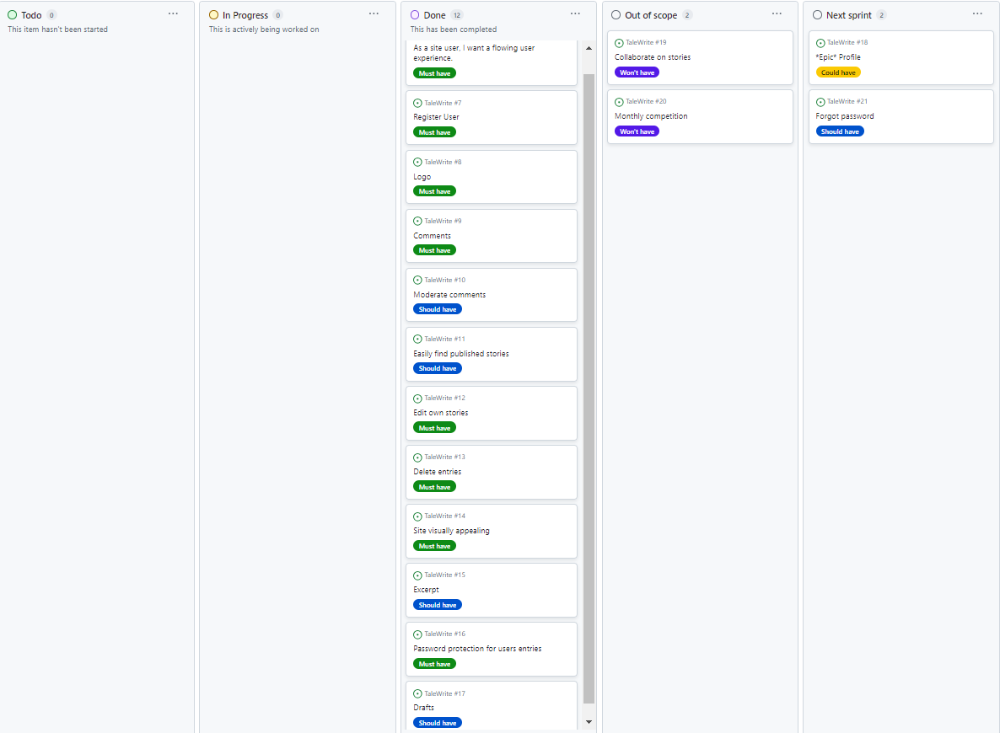

<h1>TaleWrite README.MD</h1>

<h2>Introduction</h2>

TaleWrite is a short story website. It provides the user with the ability to write and publish their short tales on the website, edit them if desired, and read the published tales of other authors. By creating their own account they can then interact with the site.

Features include including likes, genres, and excerpts, to intrigue potential readers on the home page - which doybles as a listing of published tales. Lastly the "published on" attribute allows authors and readers to keep track of tales and return to edit, delete, or read again if desired.

Please be aware that TaleWrite is the name of the project, which changed from Diary in the code. And in following ReadME, "entry" is synonymous with "tale".

## Home/Entries list page 

## Home/Entries list page (for first time users)

The landing page of the website allows users to see the TaleWrite logo for brand visibility, and a list of published tales, including a short excerpt, genre, author, and the time and date the tale was published on. It informs the user if they are logged in or not with a welcome back message if logged in, and a login or sign up message if not. If the user attempts to read a tale without logging in they will be redirected to the login page.

<strong>Landing/entries list page</strong>

## Read page (home and landing page for returning users) 

<strong>Entry list zoomed in</strong>

 

<strong>Write</strong>
 

 

<strong>Entry: top</strong>

 

<strong>Entry: bottom from non-author's POV</strong>

This page shows the bottom of a Read:Tale page showing a like button and comments section. It is possible for readers to leave a comment which awaits moderation before being published.

<strong>Read:Tale from author's POV</strong>

This page shows the bottom of a Read: Tale page showing the options available to the author of the tale. This includes a delete button, edit button, and like button. These are only visible to the user who is also the author of the tale. It is also possible to leave a comment, usually it would be in response to another users comment.

<strong>Delete</strong>

This shows the delete function having been used which then displays a "entry deleted successfully" message, and redirect to the homepage.

 

This shows the edit function having been used which then displays a "entry deleted successfully" message, and redirect to the homepage.

 

## Design Choices

TaleWrite adopted a distinctive, rich and warm-dark colour scheme. We want the user to feel as thought they are relaxing in an old leather chair with a brandy, and smell the musky pages as they read and write. It was inspired by an Edgar Allen Poe book of short stories.

   

For fonts I selected the Garamond style, and increasing or decreasing the font-weight as appropriate. 'https://fonts.google.com/specimen/EB+Garamond'. It works together with our colour scheme to create the impression of reading a book printed many decades ago.

 

## Wire Frames

Initially I wanted to provide images that would excite and inspire the user of the site but it simply didn't work elegantly or provide the font with clarity therefore the hero images and parchment background were dropped in favour of a monotone off-white for readibility.

 

# Home page

I thought that a nice plain landing page that implies the story of the website would be a nice user experience, but the hero image rendered the text of the entries list illegible.

# Account sign-up page

Login Page ended up was pre packaged by Django so we ended up with a fairly similar page but without the email address field.

# Read page

Entries page. I think that we did beter in the end with some extra features to be discussed in the ReadMe. However unfortunately I ran out of time to produce a filtering function which would be essential if the website gathers more users for them to keep track of entries. However, for now it is not essential, as we coded so that new entries authomatically go to the top of the entries list.

# Write page

Write entries page. I feel that in actuality this was probably better than anticipated. I was able to add other fields such as excerpt and genre which I think add texture to the user experience.

The biggest regret in terms of functionality is that I ran out of time to add a draft/publish option, however users are still able to edit entries.

## Database Schema

## User Stories, features and bugs

I used a canban board and the MSCW approach to my user stories and features. 

Some I decided fell outside the scope of this project given time and staffing limitations. 

There were others that I intended to do, however despite all efforts and the importance of the features, remain uncompleted this sprint.

<table>
  <tr>
    <th>User Story</th>
    <th>Features</th>
    <th>Bugs / Issues - tested across viewports of all devices using Google Dev Tools</th>
  </tr>
   <tr>
    <td>As a site user, I want a flowing user experience. </td>
    <td>Ability to navigate from feature to feature as expected without interruption or detour</td>
    <td>-Success messages after all successful user interaction with the site may damage the user experience after a while for the user.
     However there is a x function to remove the message immediately. Unfortunately as well it wasn't possible to get the message to sit in the navbar which is a bug to be fixed next sprint.

  -If the user is not logged in and attempts to access an "authentication-required" page I should have ensured they are redirected there after logging in. However there are instances when the user is returned to the home page after logging in instead.</td>
   
    
  </tr>
  <tr>
    <td>As a site user I can signup an account so I can login and interact with the site</td>
    <td>Sign up functions</td>
    <td>None detected</td>
  
  </tr>
   <tr>
    <td>As a site owner, I want the logo clearly visible to increase brand recognition.</td>
    <td>Logo clearly visible on landing/options page.</td>
    <td>None detected</td>
  <tr>
    <td>As a user, I want to be able to leave comments and have other users comment on my entries</td>
    <td>Comments section in which users can leave comments below entries, pending moderation from the superuser</td>
    <td>The necessity for all comments to be moderated may hurt the user experience and decrease sense of immediacy and intimacy in the community</td>
  </tr>
  <tr>
    <td>As site owner I want to be able to moderate comments to ensure a pleasent toxicity-free community of authors and readers</td>
    <td>All comments await moderation from superuser, and an automatic message informs commenter of this</td>
    <td>None deteced</td>
    
  </tr>
  <tr>
    <td>As a site user I want to be able to easily access all published stories</td>
    <td>Stories easy to upload and clearly visible on website.</td>
    <td>Whilst uploading is easy and entries are clearly visible, the ability to filter/sort wasn't completed (see features to be implemented next sprint below). </td>
    
  </tr>
  <tr>
    <td>As a site user, I want to be able to edit my own entries</td>
    <td>A button that allows the user to edit their own entries is generated on the "entry_detail" page (read specific entry) if the author and user are the same.</td>
    <td>None detected</td>
    
  </tr>
  <tr>
    <td>As a site user, I want to be able to delete entries.</td>
    <td>A button that allows the user to edit their own entries is generated on the "entry_detail" page (Read) page if the author and user are the same. There is also a javascript alert that pops up requesting confirmation "Are you sure you want to delete this tale?"</td>
    <td>Unfortunately I was unable to code a "request confirmation" function that would be seamless within the styling of the site, which will likely disrupt the user experience and may make them uncomfortable about clicking what looks like a popup from an external  site.</td>
    
  </tr>
  <tr>
    <td>As a user, I want the site to be visually appealing.</td>
    <td>Rich tawny burgundy invokes the vibe of old leather and relaxation, and off-white yellow suggests old, well-read book pages. The logo of an open book and quill adds to the old fashioned hues</td>
    <td>None detected</td>
    
  </tr>
  <tr>
    <td>As a user to be able to leave a short excerpt to entice others to read my entries</td>
    <td>Excerpts are required field for all entry submissions. An elipsis will automatically append to the end of the excerpt to increase the intrigue.</td>
    <td>None detected</td>
    
  </tr>
    <tr>
    <td>As a user I would like my data and entries to be secure from interference from other users</td>
    <td>Passwords are required to login and users cant access individuals stories without logging in. Also only authors can see the edit and delete buttons on their own entries. Also  there is further authentication required, to prevent even users who guess the url of the page from accessing the edit or delete URLS unless they are the author of the entry.</td>
    <td>None detected</td>
    
  </tr>
  
   
  </table>

 

### User Stories and Features (to be implelemented next Sprint)

  <table>
  <tr>
    <th>User Story</th>
    <th>Features</th>
    <th>Bugs / Issues</th>
  </tr>

  <tr>
    <td>As a site user I want to be able to save drafts so that I can ensure they are of good quality before publishing them for others to read</td>
    <td>A simple save button at the bottom of the Write page, and a profile page allowing authenticated users to access their stories</td>
    <td>N/A</td>
  </tr>
<tr>
    <td>As a site user I want to be able to filter/sort all published stories so I can access specific ones</td>
    <td>Unable to be added this sprint due to time constraints. To be added ASAP next sprint, as the user base builds</td>
    <td>N/A</td>
    
  </tr>>
  

  </table>

### Won't haves

  <table>
  <tr>
    <th>User Story</th>
    <th>Features</th>
    <th>Bugs / Issues</th>
  </tr>
  <tr>
    <td>As a user, I want to be able to collaborate on stories with other users</td>
    <td>The ability to co-write entries may be very fun but seems fraught with hazards. It sounds like a merge error waiting to happen.</td>
    <td>N/A</td>
  </tr>
    
 
  <td>Monthly random genre/ picture prompt competition</td>
    <td>API to provide a random picture to act as a prompt once a month and the user with the highest number of likes within the month wins a digital trophy. Failing that a randomly selected genre from a list. However whilst this may be able to be coded in the sies 2.0 or 3.0, it isnt a core functionality and therefore isn't to be prioritised.</td>
    <td>N/A</td>
  </table>

## Fixed Bugs / Issues
 
<table>
  <tr>
    <th>Bug/Issue</th>
    <th>Resolution</th>
    <th>Image</th>
  </tr>
  <td>CSS not working at all. I could see in dev tools that it wasn't being even sent let alone rendered on the page.</td>
    
    
  <td>It turned out that it was an issue where the style.css in both static and static files needed to both be up to date</td>
  </tr>
      
  </tr>
    <td>The submit button would disappear beneath the footer no matter the media query</td>
   
   <td>CSS position: sticky solved the problem and kept the footer and header at the top of the page without obscuring other items</td>
  </tr>
    </tr>
    <td>Due to having gone off the LMS tutorial to use NetNinja I had produced my edit function using a class rather than method which meant I couldn't pick the LMS method of authenticating</td>
  <td>The answer was on stack overflow that there are built in django methods available and actually its quite simple</td>
    <td></td>
  </tr>
  <td>Uneven spacing of the nav and footer items at certain resolutions items made users feel very off balance and inefficient use of page space</td>

    
  <td>Display: Flex</td>
    <td></td>
  </tr>
    </tr>

  

  </table>

## Unfixed Bugs / Issues
 
<table>
  <tr>
    <th>Bug/Issue</th>
    <th>Image</th>
    <th>Resolution</th>
  </tr>
  <td>Redirect following "authentication required" sometimes takes the user home instead of to the previously requested page. This is a matter of redirection that I thought I had corrected, and then ran out of time to fix</td>
  <td>NA
  </td>
   <td>NA
  </td>
  </tr>
      
  </tr>
    <td>When user presses refresh having submitted a comment on an entry then it resubmits the entry</td>
    <td></td>
    
  <td>NA</td>
  </tr>
    
  </tr>
  <td>Part bug / part fix. Basic javascript pop up to confirm user wishes to delete their entry. Style is out of keeping with the rest of the site and maybe even a security concern for a user.</td>
    <td></td>
    <td></td>
      <tr>
      <td>Select genre list unable to be accessed to be styled. This wasn't a problem deployed on PC using dev tools, but on physical iphone looked entirely out of keeping with styling of the site
       
    <td></td>
     
  </tr>
  <tr>
    <td>Users can like an entry an indefinite number of times up to 28. At this point the like button vanishing when mouse hovereed over it and the clickbox obviously disappeared too as nothing happened when hovered and clicked over the area</td>
    <td></td>
     </td>
    <td></td>
  

  </table>

### Validator Testing 

For HTML validation https://validator.w3.org/

For CSS validation  https://jigsaw.w3.org/css-validator/

Contrast checking 

  
Contrast Readibility validation https://webaim.org/resources/contrastchecker/

## Deployment

Site successfully deployed on 

## Credits 

"Netninja" django blog tutorials https://www.youtube.com/watch?v=n-FTlQ7Djqc

"Code Institute", for initital django and elephant sql and heroku installation

Code Institute Student services for various questions regarding how to install/operate django

Stack overflow for various questions regarding how to install/operate django

Publish and edit timestamp https://www.youtube.com/watch?v=FpbJBzpoISY&t=32s

ChatGPT for help with syntax errors, particularly regarding redirecting after logging in https://chat.openai.com/c/7e591bc4-1e83-46d8-b823-029eaf780f66

Header and footer based on a website I co-coded on another hackathon https://tomcow88.github.io/teamBrizzle/

Contrast visibility checker https://webaim.org/resources/contrastchecker/

Django classes https://docs.djangoproject.com/en/5.0/topics/class-based-views/intro/

Creating classed-based functions https://www.youtube.com/watch?v=-s7e_Fy6NRU 

Responsiveness displayed on https://ui.dev/amiresponsive

Logo created by Bing Co-Pilot https://www.bing.com/images/create?FORM=GENILP

For validation in HTML https://validator.w3.org/

For validation in CSS https://jigsaw.w3.org/css-validator/

For ReadME table https://www.shecodes.io/athena/2362-creating-a-table-with-4-columns-and-4-rows-in-html

Wireframes produced using Balsamiq WireFrames https://balsamiq.com/wireframes/?gad_source=1&gclid=CjwKCAiA44OtBhAOEiwAj4gpOexFh0z3peWS6wolbjlJt_fLq7cZGNu99YeMSIpU89wlL2p6ZluXiRoCOSUQAvD_BwE

## Other General Project Advice

Thanks for reading